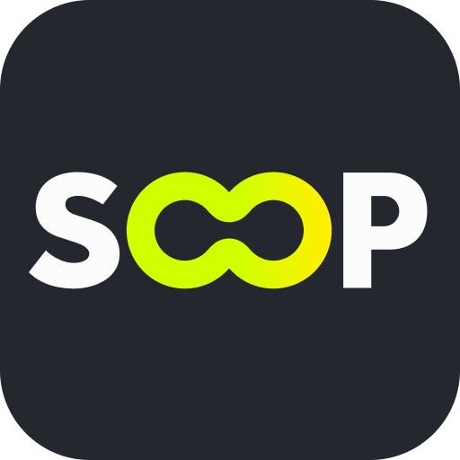
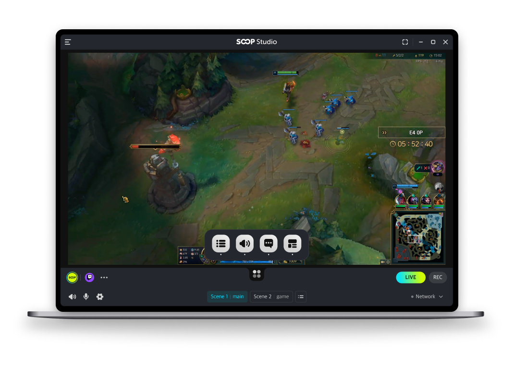

# SOOP Studio

**[SOOP](https://www.sooplive.com/) can be downloaded and installed through the service site**.

## About SOOP Studio
SOOP Studio PC version was developed so that beginners can easily set up broadcasting.
This is a desktop application that allows you to broadcast live. You can configure the screen with a simple first operation,
Stable transmission is possible on various broadcasting platforms

SOOP Studio used the OBS engine as the core module. We would thank all the developers with their wonderful work of OBS project.

## Overview

This application currently only supports windows 10,11 and macOS 11.0 and newer.

## Community

- [Github issues](https://github.com/SOOPLIVE/soop-studio/issues)
- [Contact Us](https://sooplive.helpshift.com/hc/en/3-soop/contact-us/)

## License

Copyright SOOP CO., LTD..

Licensed under the [GPL-2.0 license](LICENSE)
