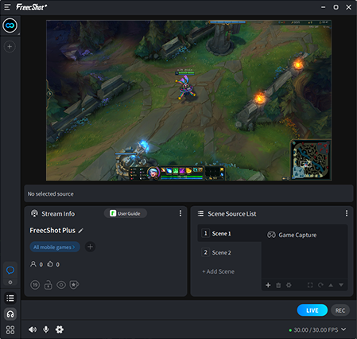

# FreecShot Plus

FreecShot Plus is available for download from the **[SOOP](https://www.sooplive.com/)** website.

## About FreecShot Plus
FreecShot Plus is a desktop application for creators who broadcast live on SOOP.
It helps streamers set up a broadcast environment, configure scenes, and start live streaming with a simple workflow.

FreecShot Plus is designed to make live broadcasting easier for beginners while providing the stability and flexibility needed for advanced broadcasts.
It supports scene composition, source management, and reliable live transmission for SOOP broadcasts.

FreecShot Plus uses the OBS engine as its core module.
We sincerely thank all contributors to the OBS Project for their wonderful work.

**Note:** SOOP Studio has been renamed to FreecShot Plus.

## Overview

This application currently supports Windows 10, Windows 11.

## Community

- [Github issues](https://github.com/SOOPLIVE/soop-studio/issues)
- [Contact Us](https://sooplive.helpshift.com/hc/en/3-soop/contact-us/)

## Download
- [Download Installer](https://update.sooplive.com/FreecShotPlus_installer.exe)

## License

Copyright SOOP CO., LTD.

Licensed under the [GPL-2.0 license](LICENSE)
